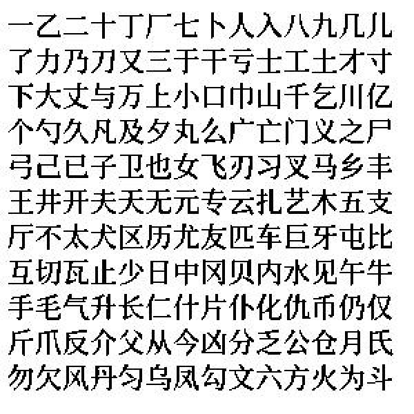
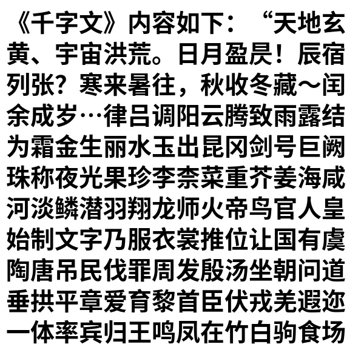
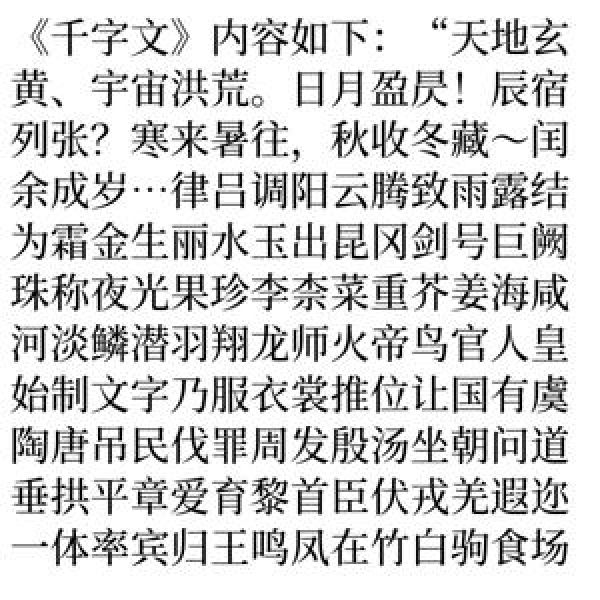
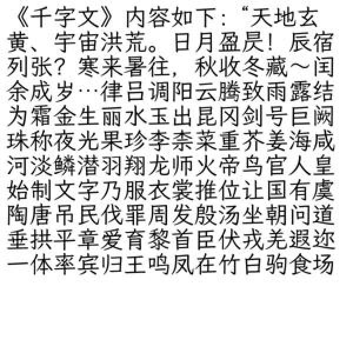

# README
## 书之溯源 SourceBook
把低分辨率的扫描书恢复为高分辨率，是我多年夙愿。在了解到有超分辨率这一技术的时候，我就寄期望于能够用超分技术达成目的。

时间一天天过去，最后还是自己不完美地做了实现。

书之溯源即恢复书本身的模样，亦是书之夙愿的谐音；SourceBook中的Source是追溯的意思，也指代数据集中的一部分图片使用思源字体（Source Han）。


## 关于数据集
训练使用的数据集包含多个部分的内容：

| 类型 | 文件前缀 | 来源 | 备注 | 链接 |
|----|----|----|----|----|
| 纯文本  |  sourcehan2  | 使用思源宋体合成纯文本图片，包含常见中英文字符及假名  | 黑白 | https://github.com/adobe-fonts/source-han-serif   |
| 纯文本  |  sourcehan  | 使用思源宋体合成纯文本图片，包含千字文及假名  |  灰阶  |   https://github.com/adobe-fonts/source-han-serif |
| 纯文本  |  sourcehan1  | 使用思源黑体合成纯文本图片，包含千字文及假名  |  灰阶  |   https://github.com/adobe-fonts/source-han-sans|
| 纯文本  | wenkai  |  使用蒹葭文楷合成纯文本图片，包含千字文及假名  |  灰阶  | https://github.com/lxgw/LxgwWenKai   |
| 纯文本  | crimson |  使用Crimson Text合成纯文本图片，包含英文衬线体普通、粗体、斜体，降采样后无处理  |  灰阶  | https://fonts.google.com/specimen/Crimson+Text  |
|  书籍  |  realbook  |  图书《圈圈教你玩USB》节选扫描，作者: 刘荣  | 灰阶 |  见 [相关法律](#相关法律)  |
|  彩图  |  color  |  为避免色彩推理错误，添加彩图数据。含colored manga 漫画数据集及其他一些ACG彩色图片，缩小1/2使用  | 彩色 |  https://www.kaggle.com/datasets/ultraamvking/colored-manga  |


担心污染暂未使用的数据，备选
| 类型 | 文件前缀 | 来源 | 备注 | 链接 |
|----|----|----|----|----|
|  钢琴谱  |  piano  |  钢琴谱电子档，非出版物  |    |   |
|  漫画  |  manga  |  OpenMantra 漫画机器翻译评估数据集  |    |  https://github.com/mantra-inc/open-mantra-dataset  |


## 关于模型
我已经使用[Real-ESRGAN](https://github.com/xinntao/Real-ESRGAN/)和此数据集训练基于官方x2plus预训练模型的2x微调模型。


扫描书修复效果-输入输出对比图： [样本](https://imgsli.com/MTg1MTA1/0/5)   
扫描书修复效果-与官方模型对比： [样本1](https://imgsli.com/MTg0OTQ5) [样本1](https://imgsli.com/MTg0OTUy)


| 模型 | SourceBook-X2 | X4plus | X4plus-Anime   | Animevideov3-X4 |
|:--:|:-------------:|:------------:|:-----------:|:---------------:|
| 缩放倍率 | 2            | 4        | 4       | 4           |
| 速度 | Baseline            | 0.29x        | 0.94x       | 7.14x           |

* 以上评估均使用ncnn模型测试


## 下载
ncnn模型及Windows、Linux推理程序见本仓库release页面: https://github.com/tumuyan/SourceBook-Dataset/releases  

pth模型下载（训练log也在huggingface仓库中）: https://huggingface.co/tumuyan/SourceBook/tree/pth/models  

colab推理（使用pth模型）: https://colab.research.google.com/drive/1E2IEo1zUapxMuOb2Px3VYy_zhDsu9OTR?usp=sharing


## 目录结构
```
├─beforecrop            // 分辨率>480*480未切片的图片，备用
└─test                  // 测试评估数据，未切分
└─sourcebook            // Real-ESRGAN 训练数据集
    ├─meta_info         // 图像文件清单
    ├─sourcebook_hr     // 高分辨率图像
    └─sourcebook_lr     // 低分辨率图像
```

## 例图
如下例图左侧为数据集中使用字体合成的高分辨率纯文本图片，右侧为对应的低分辨率图片使用nearest放大2倍的图片。

sourcehan2
<figure class="half">
    
    
</figure>

sourcehan1
<figure class="half">
    
    
</figure>

sourcehan
<figure class="half">
    
    
</figure>


wenkai
<figure class="half">
    
    
</figure>


## 相关法律
> 中华人民共和国著作权法
>
> 第二十四条 在下列情况下使用作品，可以不经著作权人许可，不向其支付报酬，但应当指明作者姓名或者名称、作品名称，并且不得影响该作品的正常使用，也不得不合理地损害:
>
> (一)为个人学习、研究或者欣赏，使用他人已经发表的作品;
>
> ...
>
> (六)为学校课堂教学或者科学研究，翻译、改编、汇编、播放或者少量复制已经发表的作品，供教学或者科研人员使用，但不得出版发行;

